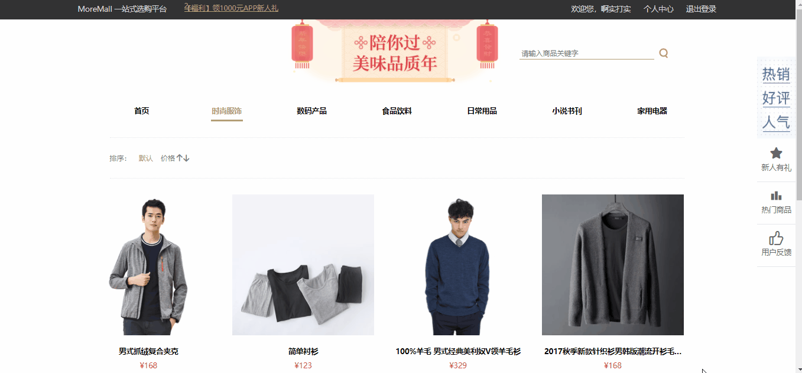
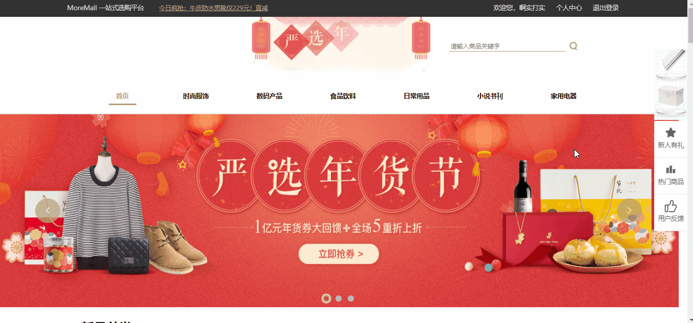
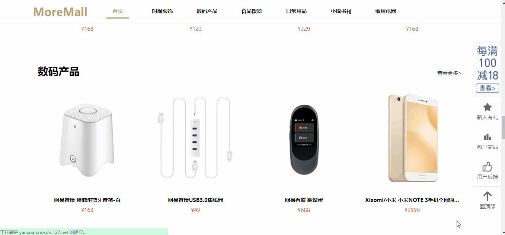
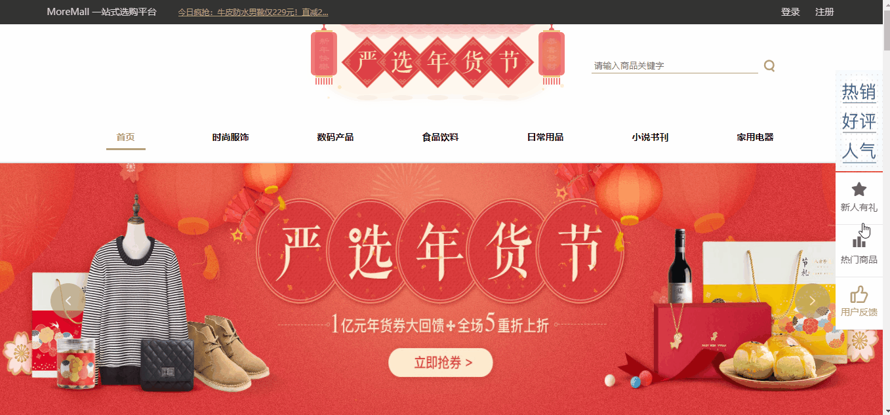
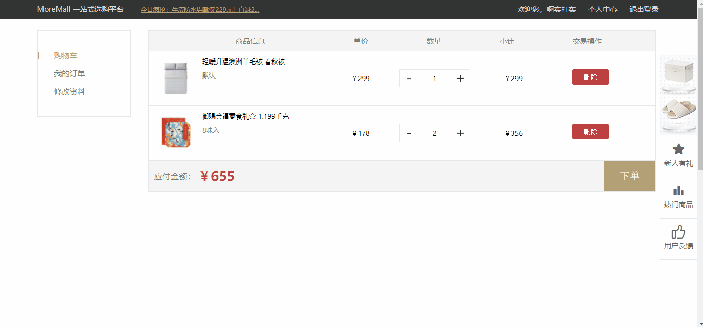
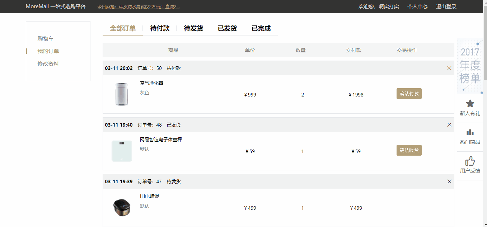
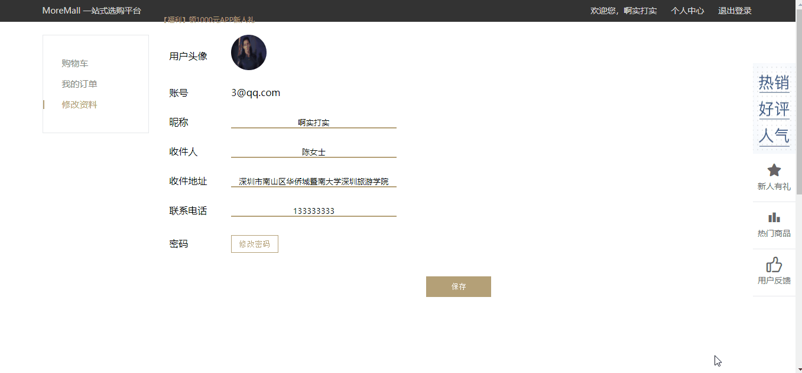
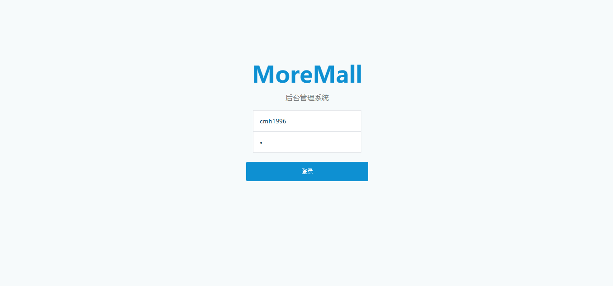

# vue-MoreMall
一个基于vue全家桶的pc端综合性网上购物商城，包括前台商城和后台管理系统，请求数据采用axios，后端采用koa2，数据库采用mysql。

## 已完成功能

1. 登录注册；
2. 商品分类；
3. 购买商品；
4. 搜索商品；
5. 购物车；
6. 订单管理；
7. 商品问答；
8. 商品评价；
9. 修改资料；
10. 后台管理；

## 项目截图

首页

商品分类页

搜索页

商品详情页

登录页

购物车页

订单页

个人资料页

后台管理页

